# FPGA IP Design Internship

**VSD (VLSI System Design) FPGA IP Internship**

---

## Overview

This repository documents the hands-on tasks completed as part of the VSD FPGA IP Design Internship. Each task involves writing C programs, cross-compiling them for the RISC-V architecture, disassembling the binaries using `objdump`, simulating execution using the Spike RISC-V ISA simulator, and analysing the effect of compiler optimisation flags on instruction count and code structure.

---

## Tools Used

| Tool | Purpose |
|------|---------|
| `gcc` | Native C compilation on host machine |
| `riscv64-linux-musl-gcc` | Cross-compiler targeting RISC-V 64-bit (musl libc) |
| `riscv64-unknown-linux-gnu-gcc` | Cross-compiler targeting RISC-V 64-bit (GNU libc, static) |
| `riscv64-linux-musl-objdump` | Disassembler for musl-compiled RISC-V binaries |
| `spike` | RISC-V ISA simulator for functional verification |
| `pk` | Proxy kernel used alongside Spike for syscall handling |
| `leafpad` | Text editor used to write C source files |
| VDI (Virtual Disk Image) | Pre-configured internship environment with full RISC-V toolchain |

---

## Optimisation Flags — Definitions

| Flag | Full Name | Description |
|------|-----------|-------------|
| `-O1` | Optimisation Level 1 | Enables basic optimisations that reduce code size and improve speed without significantly increasing compilation time. Includes dead code elimination, simple inlining, and basic loop optimisations. |
| `-Ofast` | Fast Math Optimisation | Enables all `-O3` optimisations plus aggressive floating-point transformations that may violate strict IEEE 754 compliance. Allows the compiler to reorder and vectorise floating-point operations freely, often increasing instruction count for compute-heavy code due to loop unrolling. |

---

## Commands Reference

### Native Compilation
```bash
gcc <source>.c
./a.out
```

### RISC-V Cross-Compilation (musl libc)
```bash
riscv64-linux-musl-gcc -mabi=lp64d -march=rv64g -o <output>.o <source>.c
riscv64-linux-musl-objdump -d <output>.o
```

### RISC-V Cross-Compilation with Optimisation (musl libc)
```bash
riscv64-linux-musl-gcc -O1 -mabi=lp64d -march=rv64g -o <output>.o <source>.c
riscv64-linux-musl-gcc -Ofast -mabi=lp64d -march=rv64g -o <output>.o <source>.c
```

### RISC-V Cross-Compilation with Spike Simulation (GNU libc, static)
```bash
riscv64-unknown-linux-gnu-gcc -O1 -march=rv64g -mabi=lp64d -static -o <output>.o <source>.c
spike $(which pk) <output>.o

# Debug mode — step through instructions
spike -d $(which pk) <output>.o
(spike) until pc 0 <address>
(spike) reg 0 <register>
(spike) q
```

---

---

# Task 1 — C Program Compilation and RISC-V Assembly Analysis (`sum_to_n`)

## Objective

Write a C program that computes the sum of integers from 1 to N. Compile it natively using GCC, then cross-compile for RISC-V and disassemble using `objdump`. Compare instruction counts in the `main` section under default compilation and `-Ofast` optimisation. Simulate execution using Spike.

---

## C Program — `sum_to_n.c`

A simple C program computing the sum of integers from 1 to N using a `for` loop.

**Version 1 — Sum from 1 to 5:**
```c
#include<stdio.h>

int main(){
    int i, sum=0, n=5;
    for (i = 1; i <= n; i++)
    {
        sum += i;
    }
    printf("The sum of numbers is: %d \n", sum);
    return 0;
}
```

**Version 2 — Sum from 1 to 100:**
```c
#include<stdio.h>

int main(){
    int i, sum=0, n=100;
    for (i = 1; i <= n; i++)
    {
        sum += i;
    }
    printf("The sum of numbers from 1 to %d is: %d \n", n, sum);
    return 0;
}
```

---

## Step-by-Step Walkthrough

### Step 1 — Working Directory and File Creation

Working directory confirmed and `leafpad` editor launched to create `sum_to_n.c`.

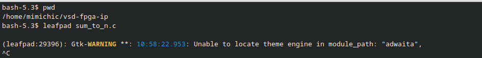

---

### Step 2 — C Source Code (n=5)

Initial version of the program summing integers from 1 to 5, written in `leafpad`.

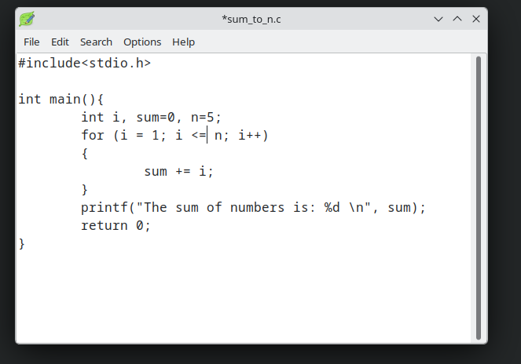

---

### Step 3 — Native GCC Compilation and Output (n=5)

```bash
gcc sum_to_n.c
./a.out
```

**Output:** `The sum of numbers is: 15`


---

### Step 4 — C Source Code Updated (n=100)

Program updated to sum from 1 to 100 with improved `printf` format.


---

### Step 5 — Native GCC Compilation and Output (n=100)

```bash
gcc sum_to_n.c
./a.out
```

**Output:** `The sum of numbers from 1 to 100 is: 5050`


---

### Step 6 — RISC-V Cross-Compilation (Default, No Optimisation)

```bash
riscv64-linux-musl-gcc -mabi=lp64d -march=rv64g -o sum_to_n.o sum_to_n.c
riscv64-linux-musl-objdump -d sum_to_n.o
```

Full disassembly output showing `.plt`, `_start`, `_start_c`, and `main` sections.

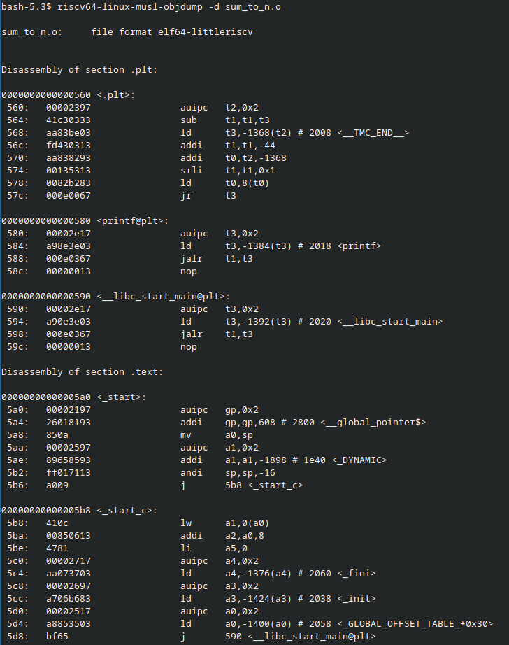

---

### Step 7 — Full RISC-V Objdump Output (Default)

Larger view of the complete disassembly output for the default compilation.


---

### Step 8 — Objdump Without Pipe (Default)

Alternate view of the objdump output without piping, showing raw terminal output.

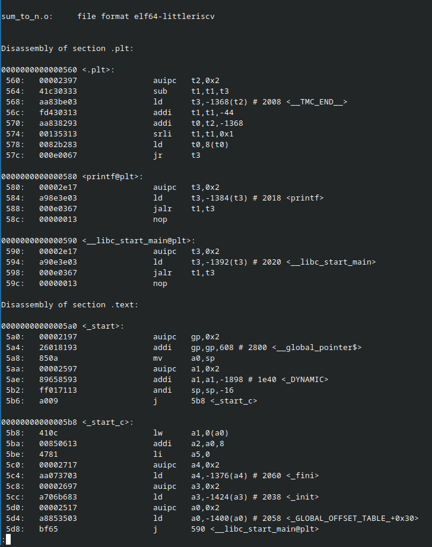

---

### Step 9 — `main` Section — Default Compilation (~15 Instructions)

The `main` function in default mode contains approximately **15 instructions**, with the full loop structure present in the assembly.


---

### Step 10 — RISC-V Cross-Compilation with `-Ofast`

```bash
riscv64-linux-musl-gcc -Ofast -mabi=lp64d -march=rv64g -o sum_to_n.o sum_to_n.c
```


---

### Step 11 — Full Objdump Output with `-Ofast`

Complete disassembly after `-Ofast` compilation showing optimised sections.


---

### Step 12 — `main` Section — `-Ofast` Compilation (~12 Instructions)

With `-Ofast`, the `main` function is reduced to approximately **12 instructions**.

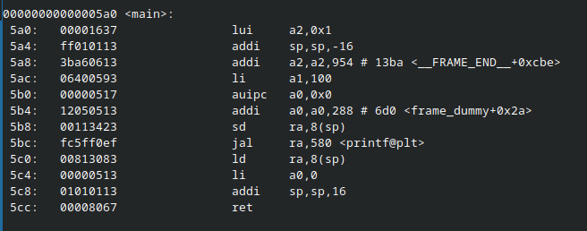

---

### Step 13 — Spike Simulation (`sum_to_n`)

```bash
riscv64-unknown-linux-gnu-gcc -O1 -march=rv64g -mabi=lp64d -static -o sum_to_n.o sum_to_n.c
spike $(which pk) sum_to_n.o
spike -d $(which pk) sum_to_n.o
```

Spike confirms correct execution and allows stepping through individual RISC-V instructions with register inspection.

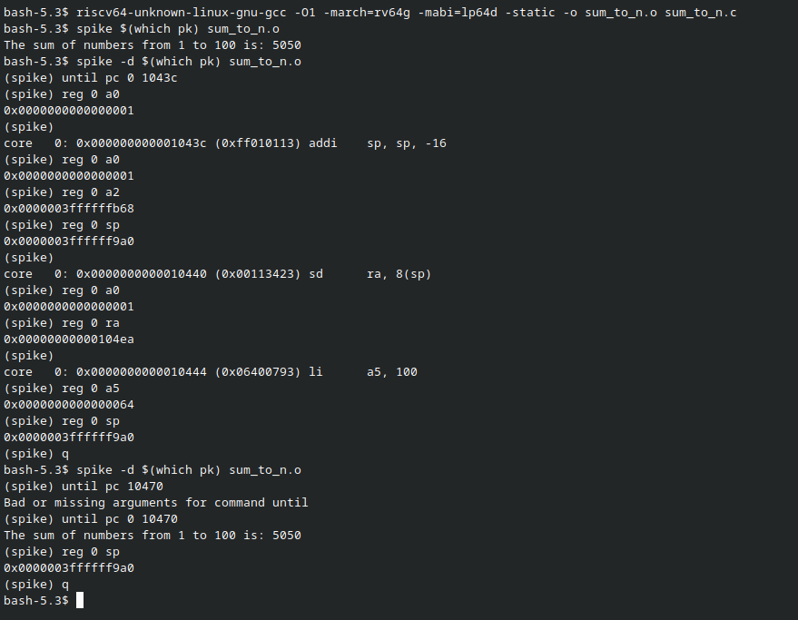

---

### Step 14 — Objdump `main` with `-O1`

```bash
riscv64-linux-musl-gcc -O1 -mabi=lp64d -march=rv64g -o sum_to_n.o sum_to_n.c
riscv64-linux-musl-objdump -d sum_to_n.o
```

With `-O1`, the `main` section is visibly reduced in instruction count.

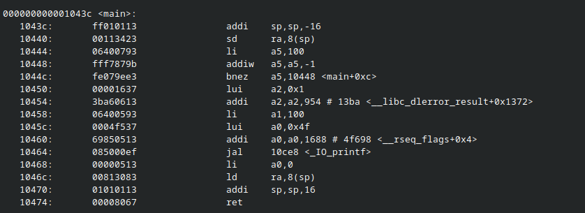

---

### Step 15 — Native GCC Compilation (n=100, final run)

```bash
gcc sum_to_n.c
./a.out
```

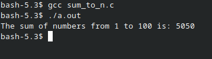

---

### Step 16 — `main` Section — No Optimisation (full view)

The `main` function with no optimisation, showing full loop body in assembly (~28 instructions).

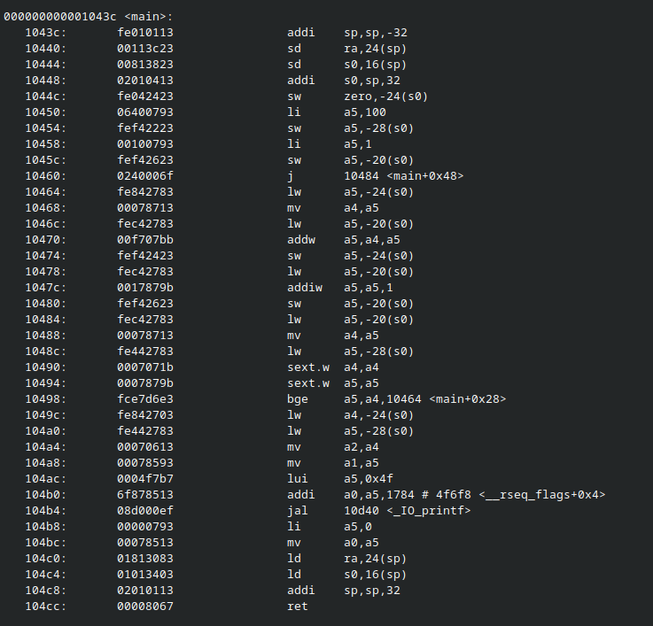

---

## Instruction Count Comparison — `sum_to_n`

| Compilation Mode | Instructions in `main` |
|-----------------|------------------------|
| Default (no optimisation) | ~28 instructions |
| `-O1` | ~15 instructions |
| `-Ofast` | ~12 instructions |

The `-Ofast` flag reduces the instruction count in `main` from approximately **28 (default) to 12**, with `-O1` providing an intermediate reduction to ~15. This demonstrates how progressive compiler optimisation generates increasingly compact RISC-V assembly.

---

---

# Task 2 — Perceptron (XOR Gate) Compilation and RISC-V Analysis

## Objective

Write a C program implementing a single-layer perceptron trained to replicate an XOR logic gate. Compile natively and verify output. Cross-compile for RISC-V, disassemble under `-O1` and `-Ofast` flags, count instructions in `main`, and simulate execution using Spike to verify functional correctness on the RISC-V architecture.

---

## What We Are Achieving

A perceptron is the foundational unit of a neural network — a mathematical model of a biological neuron. In this task, we train a perceptron to learn the XOR logic function using a step activation function and a simple weight-update learning rule. The goal from a hardware perspective is to understand how a floating-point compute-intensive C program maps to RISC-V assembly under different compiler optimisation strategies, and how Spike can be used to verify functional correctness at the ISA level.

---

## C Program — `perceptron.c`

A single-layer perceptron with 3 inputs (x1, x2, x1 AND x2) trained to replicate XOR behaviour using a step activation function.

```c
#include <stdio.h>

// Training Data for an XOR Gate
// Inputs: x1, x2, and a feature engineered third input (x1 AND x2)
// Target Output: y (x1 XOR x2)
float inputs[4][3] = {
    {0.0, 0.0, 0.0},  // 0 XOR 0 = 0
    {0.0, 1.0, 0.0},  // 0 XOR 1 = 1
    {1.0, 0.0, 0.0},  // 1 XOR 0 = 1
    {1.0, 1.0, 1.0}   // 1 XOR 1 = 0
};
float targets[4] = {0.0, 1.0, 1.0, 0.0};

// Step Activation Function (Digital High/Low Logic Trigger)
int activate(float sum) {
    return (sum >= 0.5) ? 1 : 0;
}

int main() {
    float w1 = 0.0, w2 = 0.0, w3 = 0.0;
    float bias = 0.0;
    float learning_rate = 0.2;
    int trained = 0;

    printf("Training Perceptron to replicate an XOR Gate...\n");

    // Training Loop
    for (int epoch = 0; epoch < 100; epoch++) {
        // ... weight update logic ...
    }
    // ... print weights and test results ...
    return 0;
}
```

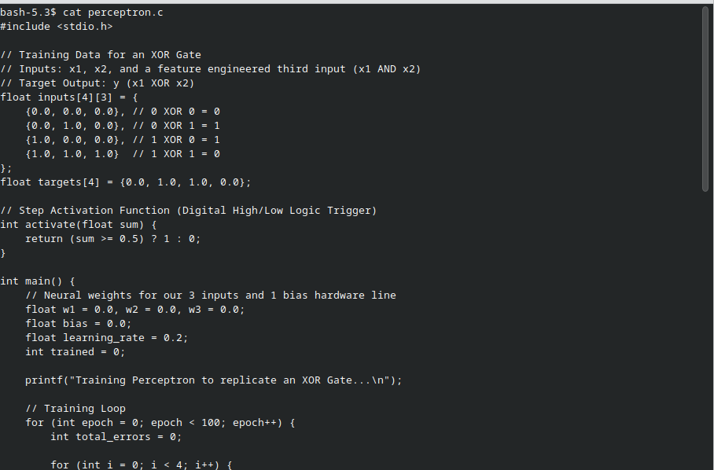

---

## Step-by-Step Walkthrough

### Step 1 — Native GCC Compilation and Output

```bash
leafpad perceptron.c
gcc perceptron.c
./a.out
```

The perceptron trains successfully and stabilises at **Epoch 7**, correctly replicating XOR behaviour for all four input combinations.

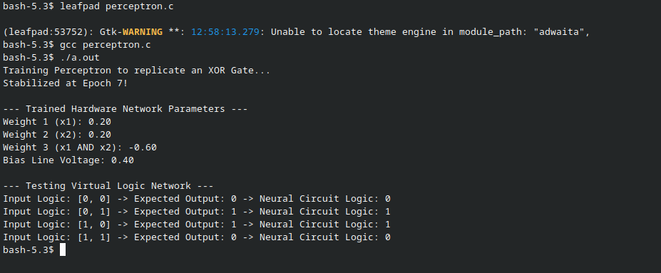

---

### Step 2 — Perceptron Output (Detailed)

```
Training Perceptron to replicate an XOR Gate...
Stabilized at Epoch 7!

--- Trained Hardware Network Parameters ---
Weight 1 (x1): 0.20
Weight 2 (x2): 0.20
Weight 3 (x1 AND x2): -0.60
Bias Line Voltage: 0.40

--- Testing Virtual Logic Network ---
Input Logic: [0, 0] -> Expected Output: 0 -> Neural Circuit Logic: 0
Input Logic: [0, 1] -> Expected Output: 1 -> Neural Circuit Logic: 1
Input Logic: [1, 0] -> Expected Output: 1 -> Neural Circuit Logic: 1
Input Logic: [1, 1] -> Expected Output: 0 -> Neural Circuit Logic: 0
```

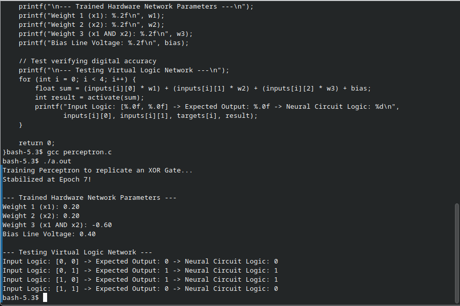

---

### Step 3 — RISC-V Cross-Compilation with `-O1` and Objdump

```bash
riscv64-linux-musl-gcc -O1 -mabi=lp64d -march=rv64g -o perceptron.o perceptron.c
riscv64-linux-musl-objdump -d perceptron.o
```

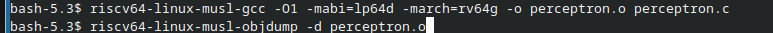

---

### Step 4 — Objdump `main` Section — `-O1`

The `main` function with `-O1` starts at address `0x10448` and ends at `0x10674`.

**Instruction count:** (0x10674 − 0x10448) / 4 = **139 instructions**

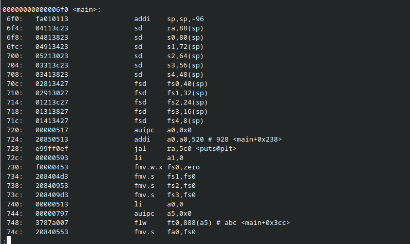

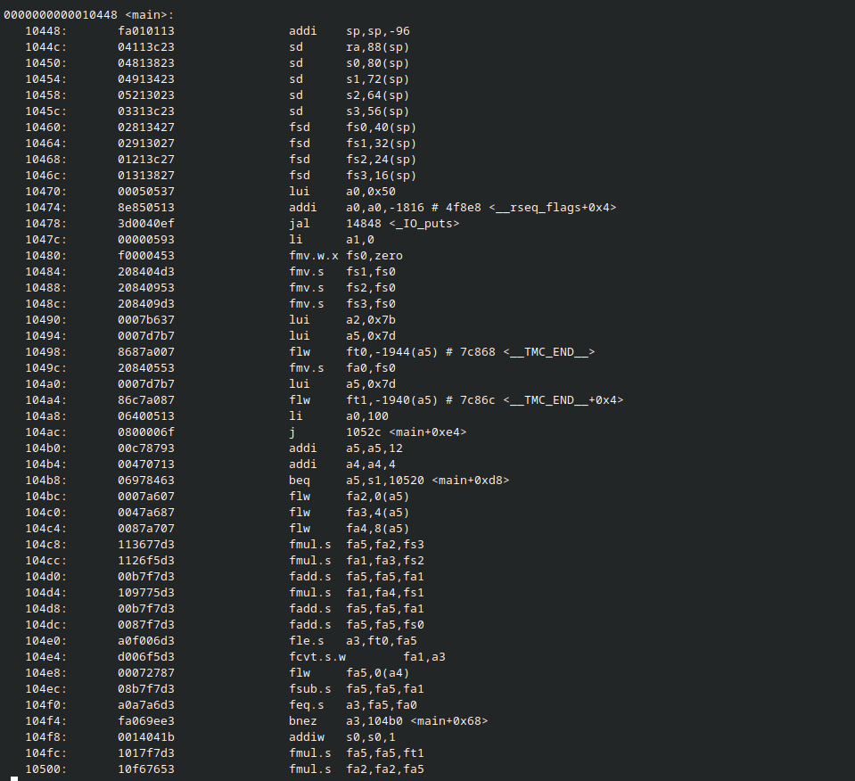

---

### Step 5 — Spike Simulation — `-O1`

```bash
riscv64-unknown-linux-gnu-gcc -O1 -march=rv64g -mabi=lp64d -static -o perceptron.o perceptron.c
spike $(which pk) perceptron.o
spike -d $(which pk) perceptron.o
```

Spike confirms correct execution of the perceptron on the RISC-V ISA under `-O1`.

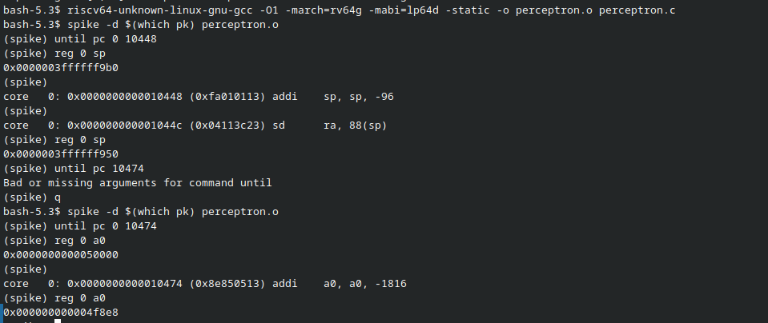

---

### Step 6 — RISC-V Cross-Compilation with `-Ofast` and Objdump

```bash
riscv64-unknown-linux-gnu-gcc -Ofast -march=rv64g -mabi=lp64d -static -o perceptron.o perceptron.c
riscv64-unknown-linux-gnu-objdump -d $(which pk) perceptron.o
```

The `main` function with `-Ofast` starts at address `0x10340` and ends at `0x10628`.

**Instruction count:** (0x10628 − 0x10340) / 4 = **186 instructions**

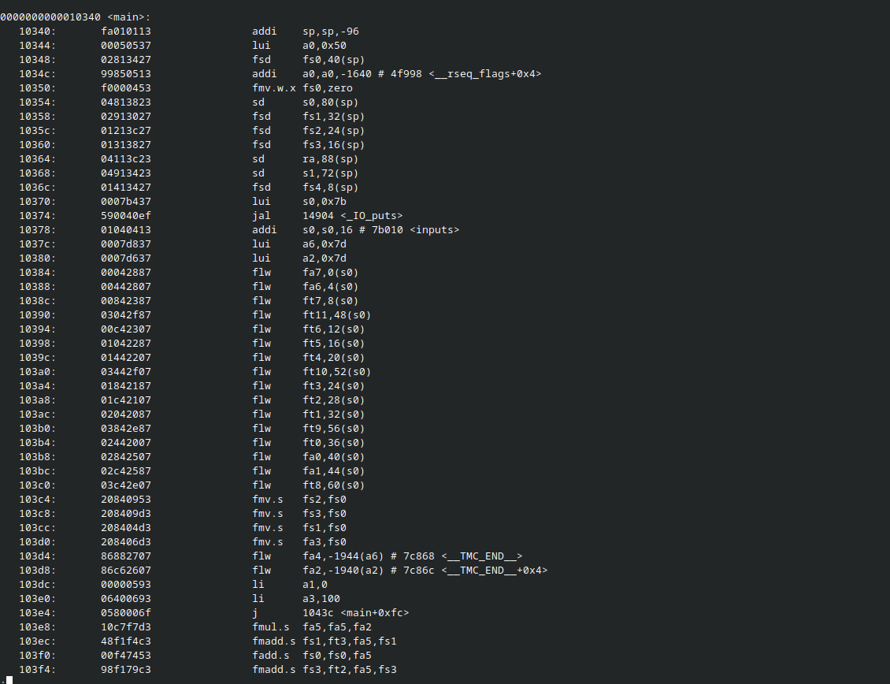

---

### Step 7 — Spike Simulation — `-Ofast`

```bash
riscv64-unknown-linux-gnu-gcc -Ofast -march=rv64g -mabi=lp64d -static -o perceptron.o perceptron.c
spike -d $(which pk) perceptron.o
```

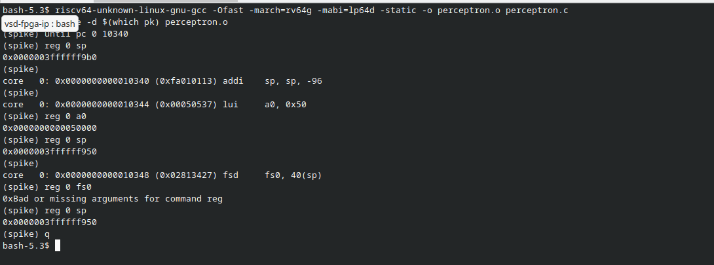

---

## Instruction Count Comparison — `perceptron`

| Compilation Mode | `main` Start Address | `main` End Address | Instructions in `main` |
|-----------------|---------------------|-------------------|------------------------|
| `-O1` | `0x10448` | `0x10674` | **139** |
| `-Ofast` | `0x10340` | `0x10628` | **186** |

### Key Observation

Contrary to what might be expected, **`-Ofast` generates significantly more instructions (186) than `-O1` (139)** for the perceptron program. This is because `-Ofast` enables aggressive floating-point loop unrolling and vectorisation — the compiler replicates loop body instructions multiple times to reduce branch overhead and exploit instruction-level parallelism. The perceptron's training loop, which involves repeated floating-point multiply-accumulate operations (`fmul.s`, `fmadd.s`, `fadd.s`), is a prime candidate for this transformation. The result is a larger but potentially faster binary when run on hardware that supports out-of-order or pipelined execution.

This is in contrast to the integer-only `sum_to_n` program, where `-Ofast` reduced instruction count because there were no floating-point operations to unroll.

---

---

# Task 3 — Environment Setup and RISC-V Reference Bring-Up (GitHub Codespace)

## Objective

Use the VSD-provided GitHub Codespace (a pre-configured cloud environment) to explore and run a complete RISC-V + FPGA reference design. Verify the pre-installed toolchain, compile and simulate a sample C program, and build the RISC-V logo firmware.

---

## What We Are Achieving

This task mirrors real semiconductor industry onboarding: environment first, reference design validation second, understanding before modification, hardware last. By running the RISC-V flow entirely inside a cloud-based Codespace with a pre-configured toolchain, we validate that the full compilation-to-simulation pipeline works before any FPGA-specific work begins. The noVNC GUI desktop inside the Codespace further demonstrates that graphical tools (gedit, terminal emulators) are available for interactive development within the same environment.

---

## Environment Used

| Component | Details |
|-----------|---------|
| Platform | GitHub Codespace (cloud-hosted) |
| Base Repository | [`vsd-riscv2`](https://github.com/vsdip/vsd-riscv2) |
| Labs Repository | [`vsdfpga_labs`](https://github.com/vsdip/vsdfpga_labs) |
| GUI Desktop | noVNC (port 6080, XFCE desktop) |
| RISC-V Compiler | `riscv64-unknown-elf-gcc` — SiFive GCC 8.3.0-2019.08.0 |
| Simulator | `spike` 1.1.1-dev + `pk` (proxy kernel) |
| FPGA Synthesis | `yosys`, `nextpnr-ice40`, `icestorm`, `iverilog` |

---

## Reference Program — `sum1ton.c`

The reference program provided in the `vsd-riscv2/samples` directory computes the sum of integers from 1 to N.

```c
#include <stdio.h>

int main(){
    int i, sum=0, n=9;
    for(i=1;i<=n;i++)
        sum = sum + i;
    printf("Sum from 1 to %d is %d \n", n, sum);
    return 0;
}
```

---

## Step-by-Step Walkthrough

---

### noVNC Desktop Tasks

### Step 1 — noVNC Desktop Launch

The noVNC desktop (port 6080) was accessed inside the Codespace to provide a full GUI Linux environment (XFCE), running on Mon 15 Jun at 13:09.

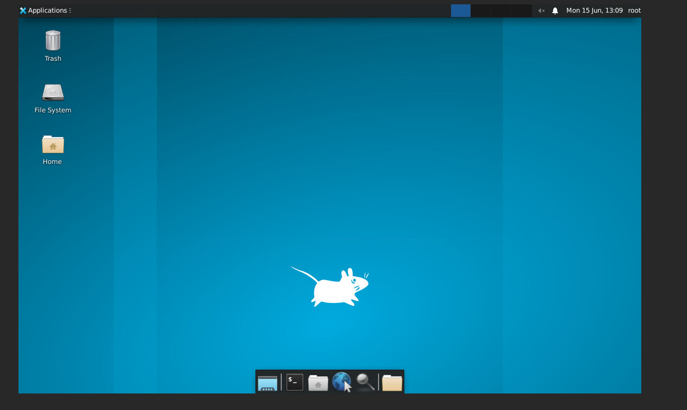

---

### Step 2 — Navigating to `samples/` and Listing Files

Inside the noVNC terminal, navigated to the `samples/` directory and listed all files present:

```bash
cd /workspaces/vsd-riscv2
cd samples
ls -ltr
```

Files present:
- `sum1ton.c` — reference C program (sum 1 to N)
- `load.S` — RISC-V assembly loader
- `Makefile` — build configuration
- `1ton_custom.c` — custom variant

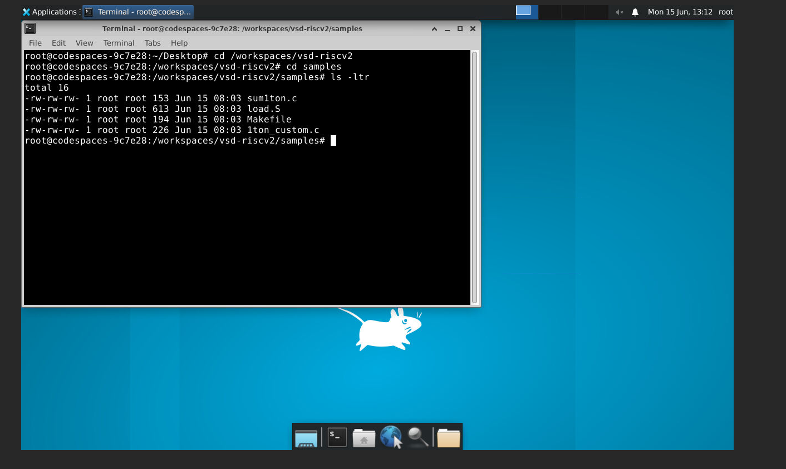

---

### Step 3 — Compiling and Running `sum1ton.c` (n=9)

Compiled `sum1ton.c` using the RISC-V cross-compiler and ran it with Spike. Note: `riscv-unknown-elf-gcc` (without `64`) was not found; the correct binary is `riscv64-unknown-elf-gcc`.

```bash
riscv64-unknown-elf-gcc -o sum1ton.o sum1ton.c
spike pk sum1ton.o
```

**Output:** `Sum from 1 to 9 is 45`

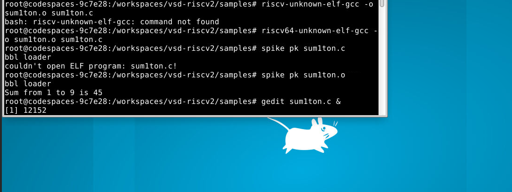

---

### Step 4 — Viewing and Modifying `sum1ton.c` in gedit

Opened `sum1ton.c` in `gedit` inside the noVNC desktop. Source code with `n=9` is visible. The value of `n` was changed from 9 to 100 and the file saved.

```bash
gedit sum1ton.c &
```

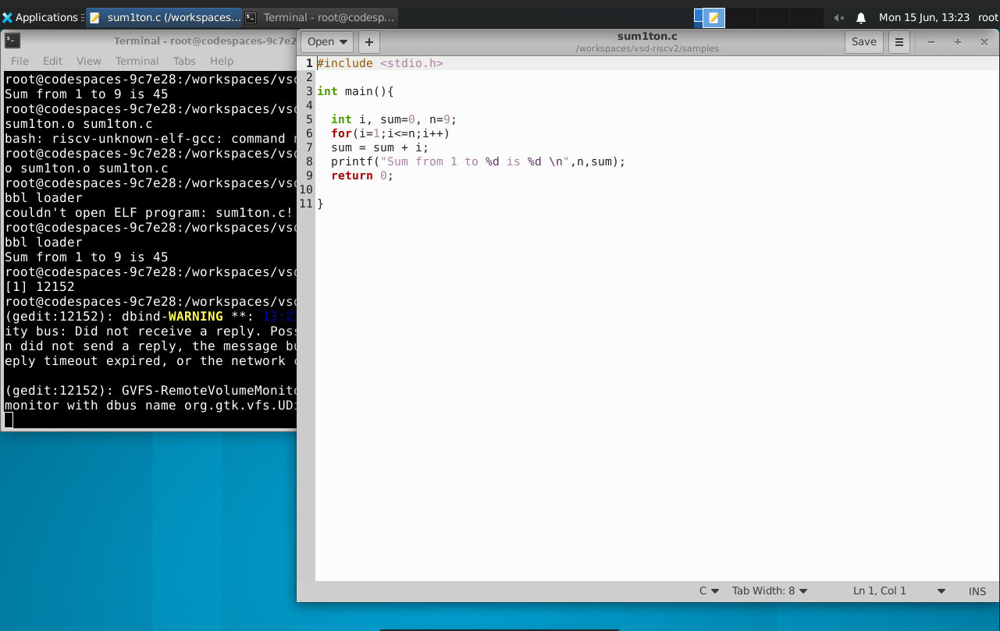

---

### Step 5 — Recompile and Run After Modification (n=100)

After modifying `n` to 100, recompiled and re-ran with Spike inside the noVNC terminal.

```bash
riscv64-unknown-elf-gcc -o sum1ton.o sum1ton.c
spike pk sum1ton.o
```

**Output:** `Sum from 1 to 100 is 5050`

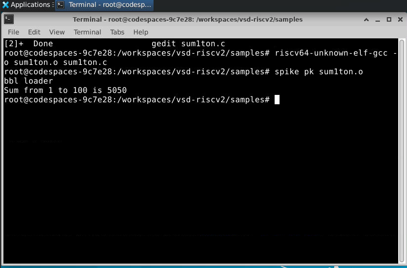

---

### Codespace Tasks

### Step 6 — Codespace Launch and VSD Banner

The VS Code Codespace terminal displays the VSD Squadron FPGA Mini banner on startup, confirming post-start scripts executed correctly. The explorer shows `samples/`, `vsdfpga_labs/`, and `README.md`. The README also documents how to launch the noVNC desktop via the PORTS tab (port 6080).

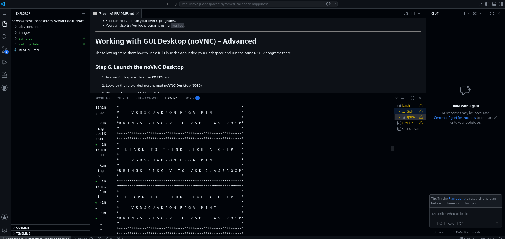

---

### Step 7 — Spike Execution via VS Code Codespace Terminal

The `spike pk sum1ton.o` command was run in the VS Code Codespace terminal, confirming consistent output. The README above the terminal shows the expected output `Sum from 1 to 9 is 45`, while the actual run with the modified program produces `Sum from 1 to 100 is 5050`.

```bash
riscv64-unknown-elf-gcc -o sum1ton.o sum1ton.c
spike pk sum1ton.o
```

**Output:** `Sum from 1 to 100 is 5050`

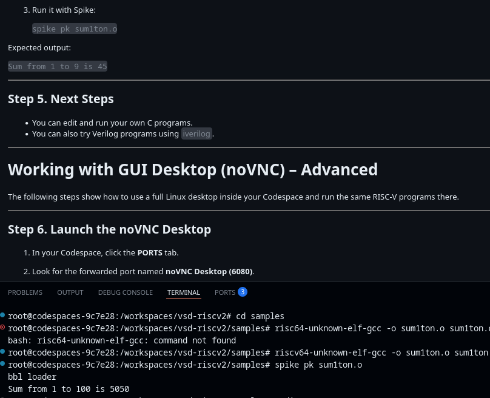

---

### vsdfpga_labs Tasks

### Step 8 — Cloning `vsdfpga_labs` Repository

Cloned the FPGA labs repository inside the VS Code Codespace terminal.

```bash
git clone https://github.com/vsdip/vsdfpga_labs.git
cd vsdfpga_labs
```

Clone completed successfully: 185 objects received, 1.44 MiB transferred.

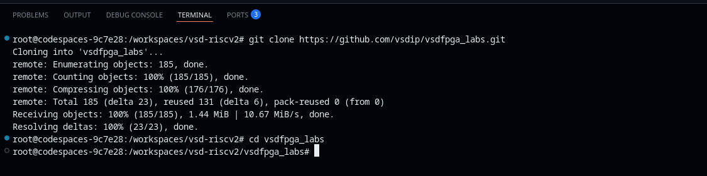

---

### Step 9 — Reviewing `vsdfpga_labs` README and Toolchain Dependencies

Inspected the `vsdfpga_labs` README from inside the cloned directory. The README documents general dependencies, FPGA toolchain (Yosys/NextPNR/IceStorm), and the SiFive RISC-V GCC 8.3.0 installation procedure.

```bash
cat README.md
```

The toolchain installation commands as documented:

```bash
# General dependencies
sudo apt-get install git vim autoconf automake autotools-dev curl libmpc-dev \
  libmpfr-dev libgmp-dev gawk build-essential bison flex texinfo gperf libtool \
  patchutils bc zlib1g-dev libexpat1-dev gtkwave picocom -y

# FPGA toolchain (Yosys/NextPNR/IceStorm)
sudo apt-get install yosys nextpnr-ice40 icestorm iverilog -y

# RISC-V Toolchain (GCC 8.3.0)
cd ~
mkdir -p riscv_toolchain && cd riscv_toolchain
wget "https://static.dev.sifive.com/dev-tools/riscv64-unknown-elf-gcc-8.3.0-2019.08.0-x86_64-linux-ubuntu14.tar.gz"
tar -xvzf riscv64-unknown-elf-gcc-*.tar.gz
echo 'export PATH=$HOME/riscv_toolchain/riscv64-unknown-elf-gcc-8.3.0-2019.08.0-x86_64-linux-ubuntu14/bin:$PATH' >> ~/.bashrc
source ~/.bashrc
```

> **Note:** FPGA tools (`yosys`, `nextpnr`, programmers, drivers) were **not installed** at this stage. The README was reviewed for understanding only.

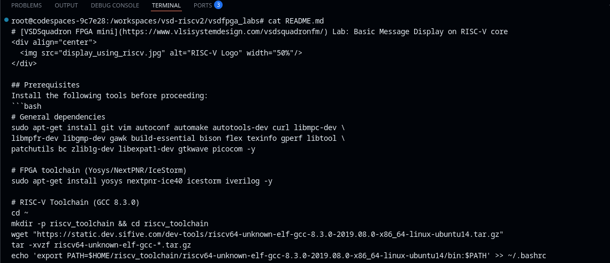

---

### Step 10 — Build the RISC-V Logo Firmware

Navigated to the `basicRISCV/Firmware` directory inside `vsdfpga_labs` and built the reference firmware:

```bash
cd ~/vsdfpga_labs/basicRISCV/Firmware
make riscv_logo.bram.hex
```

Expected output:
```
make: 'riscv_logo.bram.hex' is up to date.
```

---

### Step 11 — Run the RISC-V Logo Program with Spike

Compiled `riscv_logo.c` and simulated it with Spike to confirm the firmware and toolchain are working end-to-end:

```bash
riscv64-unknown-elf-gcc -O0 -mabi=lp64 -march=rv64i -o riscv_logo.o riscv_logo.c
spike pk riscv_logo.o
```

A successful run prints the VSD ASCII art banner:

```
bbl loader
************************************************************
*  LEARN TO THINK LIKE A CHIP  *
*     VSDSQUADRON FPGA MINI     *
*BRINGS RISC-V TO VSD CLASSROOM*
************************************************************
```

---
---

## References

- vsd-riscv2 Repository
- vsdfpga_labs Repository
- C Based Lab Video
- RISC-V Based Lab Video

---

## Author

**Amishi Singh**
VSD FPGA IP Design Internship Participant

## Repository Structure

---

## Repository Structure

```
fpga-ip-internship/
│
├── README.md
├── sum_to_n.c
├── perceptron.c
│
├── task1/
│   ├── creation_c_file.png
│   ├── sum_c_file.png
│   ├── sum_result.png
│   ├── sum_c_100.png
│   ├── sum_c_100_result.png
│   ├── riscv-instructions.png
│   ├── larger_riscv_instructions.png
│   ├── pipeless_command.png
│   ├── main_command_w_fifteen_instructions.png
│   ├── Ofast_instruction.png
│   ├── ofast_command_objdump.png
│   ├── ofast_12_instructions_only.png
│   ├── sum_to_n_gcc.png
│   ├── main_file_sum_to_n.png
│   ├── objdump_for_sum_to_n.png
│   └── sum_to_n_instructions_spike.png
│
├── task2/
│   ├── perceptron_code.png
│   ├── ml_commands.png
│   ├── output_for_perceptron_code.png
│   ├── commands_objdump_O1.png
│   ├── objdump_perceptron_O1.png
│   ├── main_instructions_perceptron_O1.png
│   ├── end_of_main_O1__to_calculate_instructions_.png
│   ├── spike_simulation_o1.png
│   ├── objdump_main_Ofast.png
│   ├── end_of_main_Ofast__to_calculate_instructions_.png
│   └── spike_simulation_Ofast.png
│
└── task3/
    ├── novnclite.png
    ├── bran_out_ut_fpgalabs.png
    ├── listoffiles.png
    ├── hitcloning.png
    ├── codespaces_block.png
    ├── readme_codespaces.png
    ├── answrforn_100.png
    ├── spike_commandresult.png
    └── geditsum1ton.png
```

---
