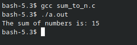
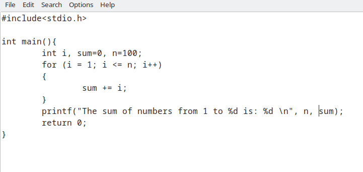
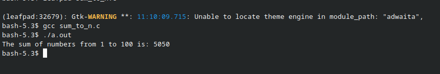
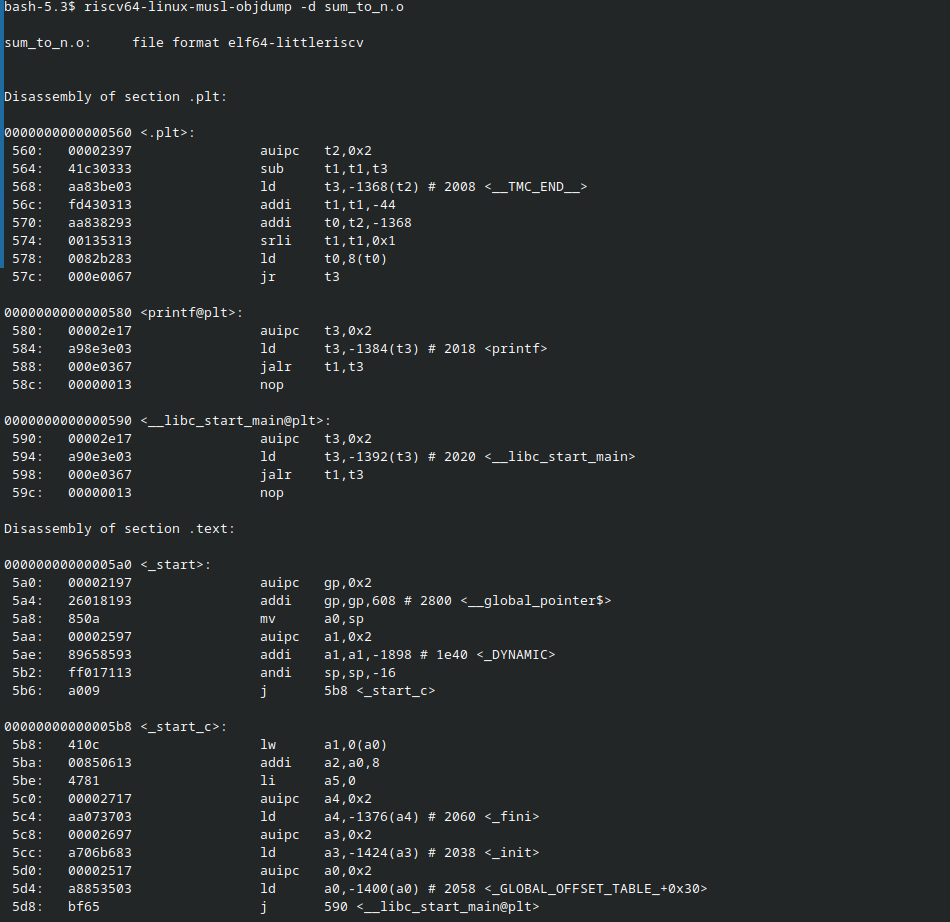
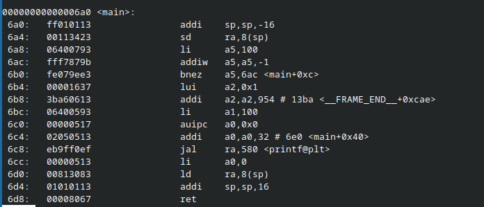
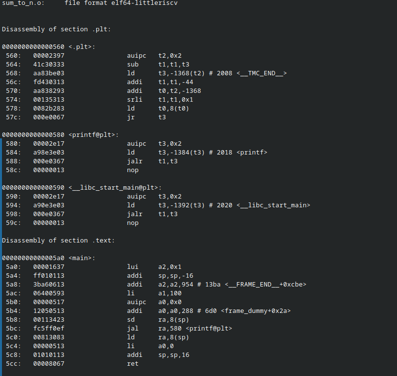

# FPGA IP Design Internship

**VSD (VLSI System Design) FPGA IP Internship**

---

## Objective

# Task 1

Write a C program, compile it using standard GCC, then cross-compile it for the RISC-V architecture using `riscv64-linux-musl-gcc`. Disassemble the object file using `objdump` and observe the generated RISC-V assembly instructions. Compare instruction counts under normal and `-Ofast` optimization.

---

## Tools Used

| Tool | Purpose |
|------|---------|
| `gcc` | Native C compilation on host machine |
| `riscv64-linux-musl-gcc` | Cross-compiler for RISC-V 64-bit target |
| `riscv64-linux-musl-objdump` | Disassembler to view RISC-V assembly |
| `leafpad` | Text editor used to write C source |
| VDI (Virtual Disk Image) | Pre-configured environment with RISC-V toolchain |

---

## C Program — `sum_to_n.c`

A simple C program that computes the sum of integers from 1 to N using a `for` loop.

**Version 1 — Sum from 1 to 5:**
```c
#include<stdio.h>

int main(){
    int i, sum=0, n=5;
    for (i = 1; i <= n; i++)
    {
        sum += i;
    }
    printf("The sum of numbers is: %d \n", sum);
    return 0;
}
```

**Version 2 — Sum from 1 to 100:**
```c
#include<stdio.h>

int main(){
    int i, sum=0, n=100;
    for (i = 1; i <= n; i++)
    {
        sum += i;
    }
    printf("The sum of numbers from 1 to %d is: %d \n", n, sum);
    return 0;
}
```

---

## Step-by-Step Walkthrough

### Step 1 — Creating the C File

Working directory confirmed and `leafpad` editor launched to create `sum_to_n.c`.


---

### Step 2 — C Source Code (n=5)

Initial version of the program summing 1 to 5.


---

### Step 3 — Native GCC Compilation and Output (n=5)

```bash
gcc sum_to_n.c
./a.out
```

**Output:** `The sum of numbers is: 15`



---

### Step 4 — C Source Code Updated (n=100)

Program updated to sum from 1 to 100 with improved `printf` format.



---

### Step 5 — Native GCC Compilation and Output (n=100)

```bash
gcc sum_to_n.c
./a.out
```

**Output:** `The sum of numbers from 1 to 100 is: 5050`



---

### Step 6 — RISC-V Cross-Compilation (Default, No Optimization)

```bash
riscv64-linux-musl-gcc -mabi=lp64d -march=rv64g -o sum_to_n.o sum_to_n.c
riscv64-linux-musl-objdump -d sum_to_n.o
```

Full disassembly output showing `.plt`, `_start`, `_start_c`, and `main` sections.


---

### Step 7 — Full RISC-V Objdump Output (Default)

Larger view of the complete disassembly output for the default compilation.




---

### Step 8 — `main` Section — Default Compilation (~15 Instructions)

The `main` function in default mode contains approximately **15 instructions**, with the full loop structure present in the assembly.



---

### Step 9 — RISC-V Cross-Compilation with `-Ofast`

```bash
riscv64-linux-musl-gcc -Ofast -mabi=lp64d -march=rv64g -o sum_to_n.o sum_to_n.c
```


---

### Step 10 — Full Objdump Output with `-Ofast`

Complete disassembly after `-Ofast` compilation showing optimized sections.



---

### Step 11 — `main` Section — `-Ofast` Compilation (~12 Instructions)

With `-Ofast`, the `main` function is reduced to approximately **12 instructions**, demonstrating the compiler's ability to generate more compact code.


---

## Key Observation — Instruction Count Comparison

| Compilation Mode | Instructions in `main` |
|-----------------|------------------------|
| Default (no optimization) | ~15 instructions |
| `-Ofast` optimization | ~12 instructions |

The `-Ofast` flag reduces the instruction count in the `main` section from approximately **15 to 12**. This demonstrates how aggressive compiler optimization generates more compact and efficient RISC-V assembly, eliminating redundant operations and improving overall code density.

---

## Repository Structure

```
fpga-ip-internship/
│
├── README.md
├── sum_to_n.c
└── snapshots/
    ├── creation_c_file.png
    ├── sum_c_file.png
    ├── sum_result.png
    ├── sum_c_100.png
    ├── sum_c_100_result.png
    ├── riscv-instructions.png
    ├── larger_riscv_instructions.png
    ├── pipeless_command.png
    ├── main_command_w_fifteen_instructions.png
    ├── Ofast_instruction.png
    ├── ofast_command_objdump.png
    └── ofast_12_instructions_only.png
```

---

## Author

**Amishi Singh**
VSD FPGA IP Design Internship Participant
