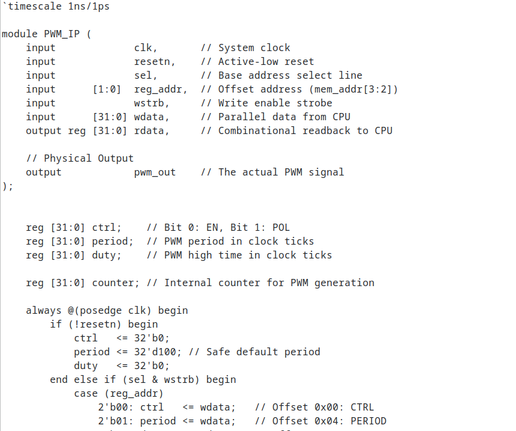
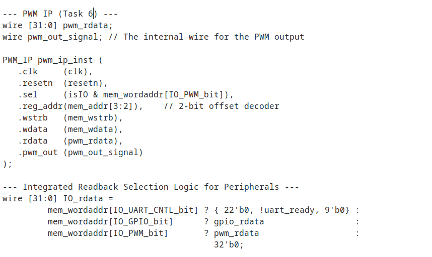
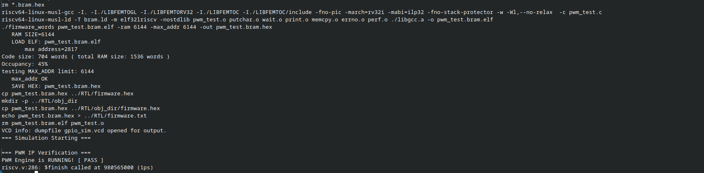
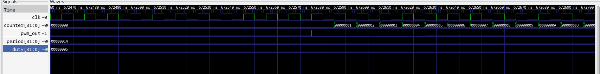

# PWM IP — Single-Channel Pulse Width Modulator

**VSD (VLSI System Design) FPGA IP Internship — Task 4 (Core Contributor)**

---

## What This IP Does

This is a single-channel, memory-mapped PWM (Pulse Width Modulation) peripheral integrated into the `basicRISCV` SoC. Software running on the RISC-V core can configure the PWM period and duty cycle by writing to four 32-bit registers over the memory bus. The IP generates a `pwm_out` signal whose high/low ratio is fully programmable, making it suitable for LED dimming and servo control applications.

---

## Register Map

**Base Address:** `0x400040` (`IO_PWM_bit = 4`, 1-hot decoded)

| Offset | Name | R/W | Description |
|--------|------|-----|-------------|
| `0x00` | `CTRL` | R/W | Bit 0: EN (1 = enable PWM). Bit 1: POL (0 = active-high, 1 = active-low) |
| `0x04` | `PERIOD` | R/W | PWM period in clock ticks. Counter runs 0 to PERIOD-1 |
| `0x08` | `DUTY` | R/W | High time in clock ticks. Output is high for DUTY ticks per period |
| `0x0C` | `STATUS` | R | Bit 0: RUNNING (reflects EN). Bits [31:16]: current counter value |

**PWM Output Rule:**
```
pwm_raw = (counter < duty)
pwm_out = POL ? ~pwm_raw : pwm_raw
```
When `EN=0`, output is forced low (or inactive level per POL).

---

## Repository Structure

```
ip/pwm/
├── README.md
├── images/
│   ├── pwm_rtl.png
│   ├── riscv_pwm_integration.png
│   ├── simulation_pwm.png
│   └── GTKWaveform_pwm.png
├── rtl/
│   └── PWM_IP.v
└── test/
    └── pwm_test.c
```

---

## Step-by-Step Walkthrough

### Step 1 — PWM IP RTL (`PWM_IP.v`)

Designed the hardware logic for the PWM peripheral from scratch. Implemented four memory-mapped registers (`CTRL`, `PERIOD`, `DUTY`, `STATUS`) with synchronous write logic and a free-running counter that resets when it reaches `PERIOD - 1`. The comparator `counter < duty` directly drives `pwm_out`.

```verilog
`timescale 1ns/1ps

module PWM_IP (
    input             clk,
    input             resetn,
    input             sel,
    input      [1:0]  reg_addr,
    input             wstrb,
    input      [31:0] wdata,
    output reg [31:0] rdata,
    output wire       pwm_out
);

    // Internal Registers
    reg [31:0] ctrl;
    reg [31:0] period;
    reg [31:0] duty;
    reg [31:0] counter;

    wire en  = ctrl[0];
    wire pol = ctrl[1];

    // Synchronous Write Logic
    always @(posedge clk) begin
        if (!resetn) begin
            ctrl    <= 32'b0;
            period  <= 32'd20;
            duty    <= 32'd10;
            counter <= 32'b0;
        end else begin
            if (sel & wstrb) begin
                case (reg_addr)
                    2'b00: ctrl   <= wdata;
                    2'b01: period <= wdata;
                    2'b10: duty   <= wdata;
                endcase
            end
            // Counter Logic
            if (en) begin
                if (counter >= period - 1)
                    counter <= 32'b0;
                else
                    counter <= counter + 1;
            end else begin
                counter <= 32'b0;
            end
        end
    end

    // PWM Output Comparator
    wire pwm_raw = (counter < duty);
    assign pwm_out = pol ? ~pwm_raw : pwm_raw;

    // Combinational Read Logic
    always @(*) begin
        if (sel) begin
            case (reg_addr)
                2'b00: rdata = ctrl;
                2'b01: rdata = period;
                2'b10: rdata = duty;
                2'b11: rdata = {counter[15:0], 15'b0, en};
                default: rdata = 32'b0;
            endcase
        end else begin
            rdata = 32'b0;
        end
    end

endmodule
```



---

### Step 2 — SoC Integration (`riscv.v`)

**1. Include the module and define the address parameter:**

```verilog
`include "PWM_IP.v"
localparam IO_PWM_bit = 4;  // Maps to physical address 0x400040
```

**2. Instantiate the IP block:**

```verilog
wire [31:0] pwm_rdata;
wire        pwm_out;

PWM_IP pwm_ip_inst (
    .clk     (clk),
    .resetn  (resetn),
    .sel     (isIO & mem_wordaddr[IO_PWM_bit]),
    .reg_addr(mem_addr[3:2]),
    .wstrb   (mem_wstrb),
    .wdata   (mem_wdata),
    .rdata   (pwm_rdata),
    .pwm_out (pwm_out)
);
```

**3. Update the combinational read multiplexer:**

```verilog
wire [31:0] IO_rdata =
    mem_wordaddr[IO_UART_CNTL_bit] ? {22'b0, !uart_ready, 9'b0} :
    mem_wordaddr[IO_GPIO_bit]      ? gpio_rdata                  :
    mem_wordaddr[IO_PWM_bit]       ? pwm_rdata                   :
                                     32'b0;
```



---

### Step 3 — Bare-Metal Firmware (`pwm_test.c`)

Wrote a bare-metal C driver targeting base address `0x400040`. Programmed a 25% duty cycle (`PERIOD = 20`, `DUTY = 5`), enabled the PWM via `CTRL`, and polled `STATUS` to confirm the engine was running before printing `[ PASS ]` via UART.

```c
#include <stdint.h>

#define UART_DAT   (*(volatile uint32_t*)0x400008)

#define PWM_BASE   0x400040
#define PWM_CTRL   (*(volatile uint32_t*)(PWM_BASE + 0x00))
#define PWM_PERIOD (*(volatile uint32_t*)(PWM_BASE + 0x04))
#define PWM_DUTY   (*(volatile uint32_t*)(PWM_BASE + 0x08))
#define PWM_STATUS (*(volatile uint32_t*)(PWM_BASE + 0x0C))

void uart_puts(const char *str) {
    while (*str) {
        UART_DAT = *str++;
    }
}

int main(void) {
    uart_puts("\r\n=== PWM IP Test ===\r\n");

    PWM_PERIOD = 20;
    PWM_DUTY   = 5;
    PWM_CTRL   = 0x1;

    if (PWM_STATUS & 0x1) {
        uart_puts("PWM Engine is RUNNING! [ PASS ]\r\n");
    } else {
        uart_puts("PWM Engine failed to start! [ FAIL ]\r\n");
    }

    while(1);
    return 0;
}
```

---

### Step 4 — Icarus Verilog Simulation

Compiled the C firmware to `pwm_test.bram.hex` via the `Makefile`, then compiled and executed the SoC simulation.

```bash
cd ip/pwm/rtl
iverilog -DBENCH -DSIM -g2012 -o SOC_sim.vvp SOC_sim_top.v riscv.v
vvp SOC_sim.vvp
```

Expected output:

```
VCD info: dumpfile gpio_sim.vcd opened for output.
=== PWM IP Test ===
PWM Engine is RUNNING! [ PASS ]
------------------------------
Simulation timeout reached.
```



---

### Step 5 — GTKWave Waveform Verification

Loaded the simulation trace into GTKWave to visually validate internal PWM signals.



**Validation Takeaways:**

| Signal | Observation |
|--------|-------------|
| `clk` | Clean toggling confirming synchronous operation |
| `period[31:0]` | Correctly latched to `0x00000014` (20 decimal) |
| `duty[31:0]` | Correctly latched to `0x00000005` (5 decimal — 25% of 20) |
| `counter[31:0]` | Counts from `0x00000001` through `0x0000000B` and wraps — free-running confirmed |
| `pwm_out` | Goes HIGH for 5 ticks, LOW for 15 ticks per period — 25% duty cycle verified |

---

## How Software Controls the IP

1. Write `PERIOD` — sets the total cycle length in clock ticks
2. Write `DUTY` — sets how many ticks the output stays HIGH
3. Write `1` to `CTRL` — enables the counter and starts the PWM engine
4. Poll `STATUS` bit 0 — confirms the engine is running
5. Update `DUTY` at any time to change brightness/position without stopping the engine

---

## How Address Offsets Are Decoded

The IP sits at base address `0x400040`, selected by bit 4 of `mem_wordaddr` (1-hot scheme). Once selected, bits `[3:2]` of `mem_addr` are passed as `reg_addr` into the IP:

| `reg_addr` | Offset | Register |
|------------|--------|----------|
| `2'b00` | `0x00` | `CTRL` |
| `2'b01` | `0x04` | `PERIOD` |
| `2'b10` | `0x08` | `DUTY` |
| `2'b11` | `0x0C` | `STATUS` |

This keeps base address selection orthogonal to internal register routing — the same pattern used in the GPIO IPs from Tasks 4 and 5.

---

## How Direction Affects Behavior

The `POL` bit in `CTRL` inverts the output:
- `POL = 0` (default): output is active-high — HIGH for `DUTY` ticks
- `POL = 1`: output is active-low — LOW for `DUTY` ticks, HIGH for the remainder

This allows the same IP to drive both active-high and active-low loads without any firmware changes beyond setting the polarity bit.

---

## References

- [vsd-riscv2 Repository](https://github.com/vsdip/vsd-riscv2)
- [vsdfpga_labs Repository](https://github.com/vsdip/vsdfpga_labs)
