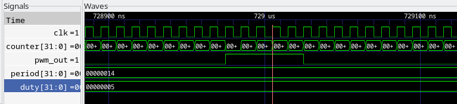

# Example Usage — Single-Channel PWM IP

---

## 1. Software Programming Model

Controlling the PWM IP from software follows a simple four-step sequence:

```
1. Write PWM_PERIOD   — set total cycle length in clock ticks
2. Write PWM_DUTY     — set active high time in clock ticks
3. Write PWM_CTRL     — set polarity and enable the engine
4. Read  PWM_STATUS   — confirm the engine is running
```

`PWM_DUTY` and `PWM_PERIOD` can be updated at any time while the engine is running to change the duty cycle on-the-fly without stopping the IP.

---

## 2. Register Address Definitions

```c
#include <stdint.h>

#define UART_DAT   (*(volatile uint32_t*)0x400008)

#define PWM_BASE   0x400040
#define PWM_CTRL   (*(volatile uint32_t*)(PWM_BASE + 0x00))
#define PWM_PERIOD (*(volatile uint32_t*)(PWM_BASE + 0x04))
#define PWM_DUTY   (*(volatile uint32_t*)(PWM_BASE + 0x08))
#define PWM_STATUS (*(volatile uint32_t*)(PWM_BASE + 0x0C))
```

---

## 3. Bare-Metal C Example — 25% Duty Cycle (`pwm_test.c`)

The following ready-to-run C code initialises the IP for a 25% duty cycle and validates its status via UART.

```c
#include <stdint.h>

#define UART_DAT   (*(volatile uint32_t*)0x400008)
#define PWM_BASE   0x400040
#define PWM_CTRL   (*(volatile uint32_t*)(PWM_BASE + 0x00))
#define PWM_PERIOD (*(volatile uint32_t*)(PWM_BASE + 0x04))
#define PWM_DUTY   (*(volatile uint32_t*)(PWM_BASE + 0x08))
#define PWM_STATUS (*(volatile uint32_t*)(PWM_BASE + 0x0C))

void uart_puts(const char *str) {
    while (*str) {
        UART_DAT = *str++;
    }
}

int main(void) {
    uart_puts("\r\n=== PWM IP Verification ===\r\n");

    PWM_PERIOD = 20;   // Total cycle: 20 clock ticks
    PWM_DUTY   = 5;    // Active time: 5 ticks = 25% duty cycle
    PWM_CTRL   = 0x01; // Enable (Bit 0 = 1), Active-High (Bit 1 = 0)

    if (PWM_STATUS & 0x01) {
        uart_puts("PWM Engine is RUNNING! [ PASS ]\r\n");
    } else {
        uart_puts("PWM Engine is stopped. [ FAIL ]\r\n");
    }

    while(1);
    return 0;
}
```

---

## 4. Validation and Expected Output

### Expected UART Output

```
=== PWM IP Verification ===
PWM Engine is RUNNING! [ PASS ]
```

### Expected Waveform Behaviour (GTKWave)

The internal `counter` counts continuously from `0` to `19`. The `pwm_out` pin remains `HIGH` while `counter` is `0–4`, and `LOW` while `counter` is `5–19`, producing a precise 25% duty cycle.



> `period = 0x00000014` (20), `duty = 0x00000005` (5), `pwm_out` HIGH for 5 ticks per 20-tick cycle confirmed.

### Expected Physical Board Behaviour

If `pwm_out` is connected to an LED on the VSDSquadron board, the LED will appear dimly lit at 25% brightness compared to a standard GPIO HIGH signal.

---

## 5. Common Failure Symptoms

| Symptom | Likely Cause | Fix |
|---------|-------------|-----|
| UART prints `[ FAIL ]` | Base address mismatch between software (`0x400040`) and `IO_PWM_bit` in `riscv.v` | Verify `IO_PWM_bit = 4` and recalculate — `2^4 * 4 = 0x40`, so base is `0x400000 + 0x40 = 0x400040` |
| `pwm_out` never goes HIGH | `DUTY = 0` or `CTRL` EN bit not set | Confirm `PWM_DUTY > 0` and `PWM_CTRL = 0x01` |
| Output always HIGH | `DUTY >= PERIOD` | Ensure `DUTY < PERIOD` for normal operation |
| Counter visible but output wrong | Polarity bit set unintentionally | Check `PWM_CTRL` bit 1 — set to `0` for active-high |
