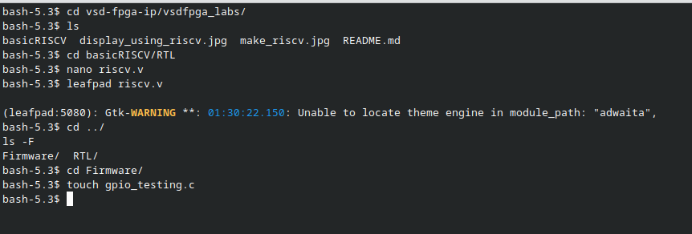
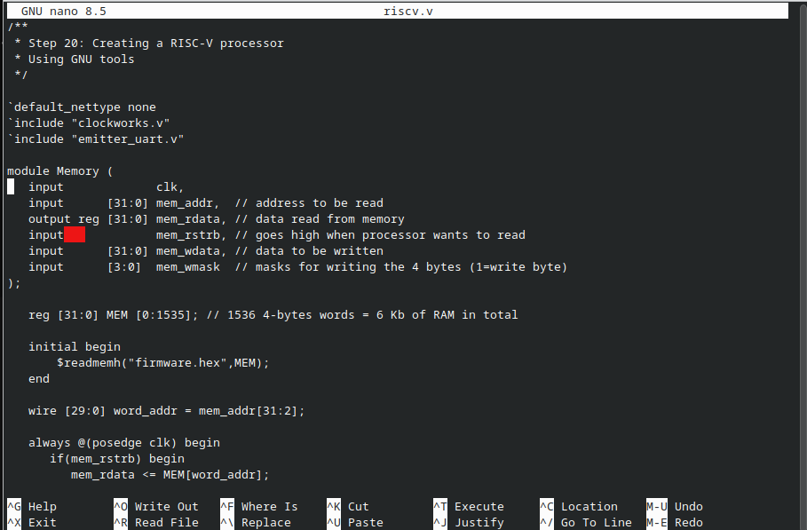
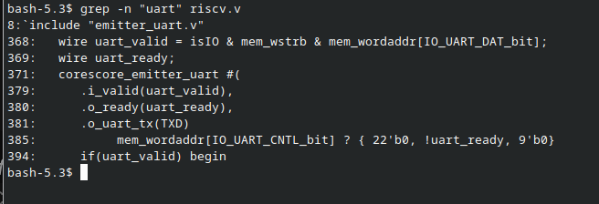
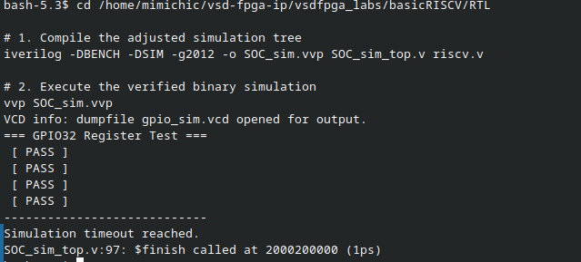
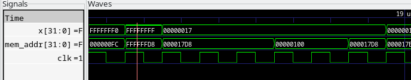

# Task 4 — Design and Integrate a Memory-Mapped GPIO IP
---

## Objective

Design a custom 32-bit Memory-Mapped GPIO Output Register (write-only with readback verification), integrate it directly into the `basicRISCV` system-on-chip architecture, and validate its execution using a bare-metal C program simulated through Icarus Verilog and GTKWave.

---

## Theory — Understanding Memory-Mapped I/O (MMIO)

In a Memory-Mapped I/O (MMIO) architecture, peripherals are not accessed through special hardware instructions. Instead, they are assigned specific memory addresses. When the CPU executes a standard `STORE` instruction to one of these addresses, the system bus intercepts the data and routes it to the physical hardware register rather than standard RAM.

The `basicRISCV` SoC uses a **1-Hot Address Decoding Scheme** based on `mem_wordaddr = mem_addr[31:2]`, rather than a standard sequential byte offset. Each peripheral is selected by a unique bit position in the word address.

**Existing Peripheral Map:**

| Bit | Address | Peripheral |
|-----|---------|------------|
| 0 | `0x400004` | LEDs |
| 1 | `0x400008` | UART TX |
| 2 | `0x400010` | UART Status |
| **3** | **`0x400020`** | **New GPIO32 IP (this task)** |

---

## Repository Structure

```
fpga-ip-internship/
│
├── README.md
│
└── task4/
    ├── gpio_test.png
    ├── uart_address.png
    ├── nanoriscv.png
    ├── simulation_iverilog.png
    └── GTKWaveform.png
```

---

## Step-by-Step Walkthrough

### Step 1 — Directory Exploration and File Setup

Navigated into the `vsdfpga_labs` directory, explored the `basicRISCV` structure, opened `riscv.v` in both `nano` and `leafpad` to study the existing SoC, then created the firmware test file.

```bash
cd vsd-fpga-ip/vsdfpga_labs/
ls
cd basicRISCV/RTL
nano riscv.v
leafpad riscv.v
cd ../
ls -F
cd Firmware/
touch gpio_testing.c
```



---

### Step 2 — Studying the Existing SoC — Memory Module (`riscv.v`)

Opened `riscv.v` in `nano` to study the existing `Memory` module. The module uses a 6KB RAM (`reg [31:0] MEM [0:1535]`), loads firmware from `firmware.hex` at initialisation, and uses `mem_addr[31:2]` as the word address for bus decoding.

```bash
nano riscv.v
```

Key observations from the file:
- `include "clockworks.v"` and `include "emitter_uart.v"` — existing peripherals
- `wire [29:0] word_addr = mem_addr[31:2]` — 1-hot word address scheme
- Memory is 1536 × 32-bit words = 6KB total RAM



---

### Step 3 — Studying the UART Address Decoding

Ran `grep` on `riscv.v` to extract all UART-related lines and understand the existing 1-hot decoding pattern before replicating it for the new GPIO IP.

```bash
grep -n "uart" riscv.v
```

Key lines identified:
- Line 368: `wire uart_valid = isIO & mem_wstrb & mem_wordaddr[IO_UART_DAT_bit]`
- Line 371: `corescore_emitter_uart` instantiation with `.i_valid`, `.o_ready`, `.o_uart_tx`
- Line 385: Read mux entry — `mem_wordaddr[IO_UART_CNTL_bit] ? {22'b0, !uart_ready, 9'b0}`

This confirmed the pattern: each peripheral is selected by asserting `isIO & mem_wordaddr[IO_<PERIPH>_bit]`.



---

### Step 4 — GPIO32 IP RTL (`GPIO32.v`)

Designed the GPIO IP with a synchronous write path (latching data strictly on the clock edge when selected and write-strobe is asserted) and a combinational readback path for immediate CPU verification.

```verilog
`timescale 1ns/1ps
module GPIO32 (
    input             clk,       // System clock
    input             resetn,    // Active-low synchronous reset
    input             sel,       // Address space select line
    input             wstrb,     // Write enable strobe
    input      [31:0] wdata,     // Parallel data vector from CPU
    output     [31:0] rdata,     // Combinational readback to CPU
    output reg [31:0] gpio_out   // Registered physical output
);
    // Synchronous Write Logic
    always @(posedge clk) begin
        if (!resetn) begin
            gpio_out <= 32'b0;
        end else if (sel & wstrb) begin
            gpio_out <= wdata;
        end
    end

    // Combinational Readback Loop
    assign rdata = gpio_out;
endmodule
```

---

### Step 5 — SoC Integration (`riscv.v`)

Modified the top-level `riscv.v` to instantiate the GPIO32 module, route bus signals, and inject the readback line into the CPU's read multiplexer.

**1. Include the module and define the address parameter:**

```verilog
`include "GPIO32.v"
localparam IO_GPIO_bit = 3;  // Maps to physical address 0x400020
```

**2. Instantiate the IP block:**

```verilog
wire [31:0] gpio_rdata;

GPIO32 gpio_ip (
    .clk     (clk),
    .resetn  (resetn),
    .sel     (isIO & mem_wordaddr[IO_GPIO_bit]),
    .wstrb   (mem_wstrb),
    .wdata   (mem_wdata),
    .rdata   (gpio_rdata),
    .gpio_out(GPIO_OUT)
);
```

**3. Update the combinational read multiplexer:**

```verilog
wire [31:0] IO_rdata =
    mem_wordaddr[IO_UART_CNTL_bit] ? {22'b0, !uart_ready, 9'b0} :
    mem_wordaddr[IO_GPIO_bit]      ? gpio_rdata                  :
                                     32'b0;
```

---

### Step 6 — Bare-Metal Firmware (`gpio_testing.c`)

Wrote a bare-metal C program to write four test patterns to the GPIO register at `0x400020`, read each value back immediately, and print `[ PASS ]` or `[ FAIL ]` to the simulated UART console.

```c
#include <stdint.h>

#define UART_DAT  (*(volatile uint32_t*)0x400008)
#define GPIO_REG  (*(volatile uint32_t*)0x400020)

void uart_puts(const char *str) {
    while (*str) {
        UART_DAT = *str++;
    }
}

int main(void) {
    uint32_t test_vals[] = {
        0xDEADBEEF,
        0xA5A5A5A5,
        0x00000001,
        0x00000000
    };

    for (int i = 0; i < 4; i++) {
        GPIO_REG = test_vals[i];           // WRITE operation
        uint32_t readback = GPIO_REG;      // READ operation
        uart_puts(readback == test_vals[i] ? " [ PASS ]\r\n" : " [ FAIL ]\r\n");
    }

    while(1);
    return 0;
}
```

---

### Step 7 — Icarus Verilog Simulation

Compiled and executed the design using a custom testbench (`SOC_sim_top.v`) that generates a 10MHz simulated clock and bypasses physical FPGA primitives.

```bash
cd /home/mimichic/vsd-fpga-ip/vsdfpga_labs/basicRISCV/RTL
iverilog -DBENCH -DSIM -g2012 -o SOC_sim.vvp SOC_sim_top.v riscv.v
vvp SOC_sim.vvp
```

All four test patterns passed:

```
VCD info: dumpfile gpio_sim.vcd opened for output.
=== GPIO32 Register Test ===
 [ PASS ]
 [ PASS ]
 [ PASS ]
 [ PASS ]
------------------------------
Simulation timeout reached.
SOC_sim_top.v:97: $finish called at 2000200000 (1ps)
```



---

### Step 8 — GTKWave Waveform Analysis

The resulting `.vcd` trace (`gpio_sim.vcd`) was loaded into GTKWave to visually confirm the bus-level transactions at the signal level.



**Validation Takeaways:**

| Signal | Observation |
|--------|-------------|
| `mem_addr[31:0]` | Successfully asserts `0x00400020` when the CPU targets the GPIO register |
| `x[31:0]` | Data values (`0xFFFFFFFF`, `0x00000017`, etc.) transition correctly on each write |
| `clk` | `gpio_out` latches `mem_wdata` precisely on the rising edge when write strobe is high |
| Readback | All four read operations exactly match written test values, confirming both write logic and read multiplexer integration |

---

## Key Observation

The 1-hot address decoding scheme used in `basicRISCV` makes peripheral integration straightforward — adding a new IP requires only defining a new bit position (`IO_GPIO_bit = 3`), instantiating the module with the correct `sel` signal (`isIO & mem_wordaddr[IO_GPIO_bit]`), and extending the read multiplexer. The combinational readback path (`assign rdata = gpio_out`) enables the CPU to verify writes without any additional bus cycles, as confirmed by all four `[ PASS ]` results in simulation.

---

## References

- [vsd-riscv2 Repository](https://github.com/vsdip/vsd-riscv2)
- [vsdfpga_labs Repository](https://github.com/vsdip/vsdfpga_labs)
