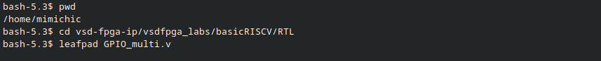
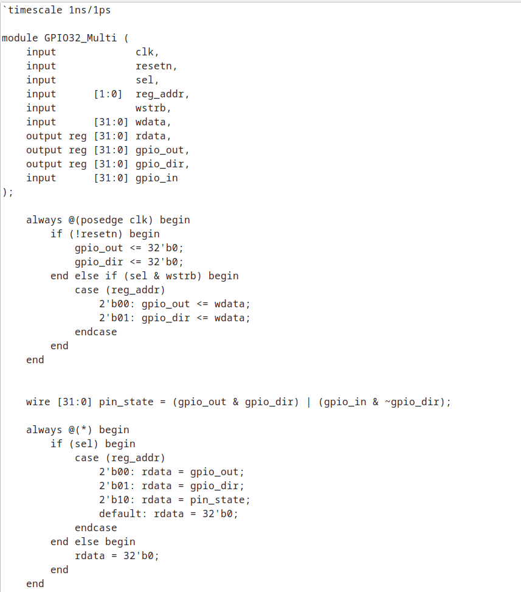
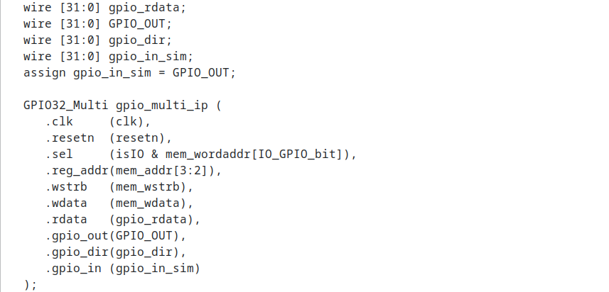
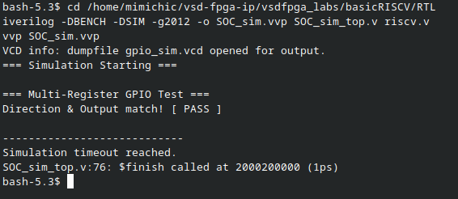
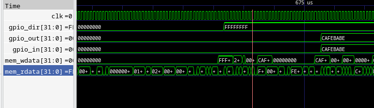

# Task 5 — Design a Multi-Register GPIO IP with Software Control

**VSD (VLSI System Design) FPGA IP Internship**

---

## Objective

Extend the single-register GPIO IP from Task 4 into a realistic, multi-register, software-controlled peripheral — similar to what exists in production SoCs. Design a proper register map, handle multiple registers inside one IP, and validate end-to-end control from software to hardware using Icarus Verilog and GTKWave.

---

## Theory — Multi-Register Peripheral Design

In Task 4, the GPIO IP only cared whether it was selected (`sel = 1`). If selected, it blindly wrote to the output register. In a real SoC peripheral, a single base address hosts multiple registers at fixed offsets. The CPU distinguishes between them using the lower address bits.

Our IP is assigned base address `0x400020`. The three registers sit at:

| Offset | Register | Description |
|--------|----------|-------------|
| `0x00` | `GPIO_DATA` | Output data — write to drive pins, read to confirm last written value |
| `0x04` | `GPIO_DIR` | Direction — `1` = output, `0` = input per bit |
| `0x08` | `GPIO_READ` | Readback — returns actual pin state (driven value for outputs, pin state for inputs) |

Because each register is 32 bits (4 bytes) wide, addresses increment by 4. Looking at bits `[3:2]` of `mem_addr`:

| `mem_addr[3:2]` | Offset | Register |
|-----------------|--------|----------|
| `2'b00` | `0x00` | `GPIO_DATA` |
| `2'b01` | `0x04` | `GPIO_DIR` |
| `2'b10` | `0x08` | `GPIO_READ` |

This 2-bit field is passed directly into the IP as `reg_addr`, giving the module full internal routing control.

---

## Repository Structure

```
task5/
├── README.md
├── gpio_multi_setup.png
├── gpio32_multi_rtl.png
├── riscv_integration.png
├── simulation_multi.png
└── 1782472779561_image.png
```

---

## Step-by-Step Walkthrough

### Step 1 — Directory Setup and File Creation

Navigated into the `basicRISCV` directory, created the new RTL file `GPIO32_Multi.v` in the `RTL/` folder and the new firmware file `gpio_multi.c` in the `Firmware/` folder.

```bash
cd vsd-fpga-ip/vsdfpga_labs/basicRISCV/RTL
touch GPIO32_Multi.v
cd ../Firmware
touch gpio_multi.c
```



---

### Step 2 — Multi-Register GPIO IP RTL (`GPIO32_Multi.v`)

Designed the new IP with internal offset decoding using `mem_addr[3:2]`. The synchronous write block routes data to either `gpio_out` or `gpio_dir` based on `reg_addr`. The combinational read block returns the appropriate register value or the actual pin state.

The physical pin state is computed as:
```
pin_state = (gpio_out & gpio_dir) | (gpio_in & ~gpio_dir)
```
Output pins reflect `gpio_out`; input pins reflect `gpio_in`.

```verilog
`timescale 1ns/1ps

module GPIO32_Multi (
    input             clk,
    input             resetn,
    input             sel,
    input      [1:0]  reg_addr,
    input             wstrb,
    input      [31:0] wdata,
    output reg [31:0] rdata,

    output reg [31:0] gpio_out,
    output reg [31:0] gpio_dir,
    input      [31:0] gpio_in
);

    // Synchronous Write Logic
    always @(posedge clk) begin
        if (!resetn) begin
            gpio_out <= 32'b0;
            gpio_dir <= 32'b0;
        end else if (sel & wstrb) begin
            case (reg_addr)
                2'b00: gpio_out <= wdata;
                2'b01: gpio_dir <= wdata;
            endcase
        end
    end

    // Combinational Read Logic
    wire [31:0] pin_state = (gpio_out & gpio_dir) | (gpio_in & ~gpio_dir);

    always @(*) begin
        if (sel) begin
            case (reg_addr)
                2'b00: rdata = gpio_out;
                2'b01: rdata = gpio_dir;
                2'b10: rdata = pin_state;
                default: rdata = 32'b0;
            endcase
        end else begin
            rdata = 32'b0;
        end
    end

endmodule
```



---

### Step 3 — SoC Integration (`riscv.v`)

Replaced the old `GPIO32` instantiation in `riscv.v` with the new `GPIO32_Multi` block. The key addition is passing `mem_addr[3:2]` as `reg_addr` so the IP can decode the register offset internally. A loopback wire (`gpio_in_sim = GPIO_OUT`) connects the output pins back to the input port for simulation without physical tri-state buffers.

**1. Include the new module at the top:**

```verilog
`include "GPIO32_Multi.v"
localparam IO_GPIO_bit = 3;
```

**2. Replace the IP instantiation block:**

```verilog
wire [31:0] gpio_rdata;
wire [31:0] gpio_dir;
wire [31:0] gpio_in_sim;

assign gpio_in_sim = GPIO_OUT;

GPIO32_Multi gpio_multi_ip (
    .clk     (clk),
    .resetn  (resetn),
    .sel     (isIO & mem_wordaddr[IO_GPIO_bit]),
    .reg_addr(mem_addr[3:2]),
    .wstrb   (mem_wstrb),
    .wdata   (mem_wdata),
    .rdata   (gpio_rdata),
    .gpio_out(GPIO_OUT),
    .gpio_dir(gpio_dir),
    .gpio_in (gpio_in_sim)
);
```

**3. The `IO_rdata` multiplexer is unchanged from Task 4** — `gpio_rdata` already handles all three register offsets internally.



---

### Step 4 — Bare-Metal Firmware (`gpio_multi.c`)

Wrote a bare-metal C program targeting the three register offsets. The program sets all pins to output mode via `GPIO_DIR`, writes a test pattern (`0xCAFEBABE`) to `GPIO_DATA`, then reads back from `GPIO_READ` (offset `0x08`) and prints `[ PASS ]` or `[ FAIL ]` via UART.

```c
#include <stdint.h>

#define UART_DAT  (*(volatile uint32_t*)0x400008)

#define GPIO_BASE 0x400020
#define GPIO_DATA (*(volatile uint32_t*)(GPIO_BASE + 0x00))
#define GPIO_DIR  (*(volatile uint32_t*)(GPIO_BASE + 0x04))
#define GPIO_READ (*(volatile uint32_t*)(GPIO_BASE + 0x08))

void uart_puts(const char *str) {
    while (*str) {
        UART_DAT = *str++;
    }
}

int main(void) {
    uart_puts("\r\n=== Multi-Register GPIO Test ===\r\n");

    GPIO_DIR  = 0xFFFFFFFF;

    uint32_t test_val = 0xCAFEBABE;
    GPIO_DATA = test_val;

    uint32_t readback = GPIO_READ;

    if (readback == test_val) {
        uart_puts("Direction & Output match! [ PASS ]\r\n");
    } else {
        uart_puts("Mismatch! [ FAIL ]\r\n");
    }

    while(1);
    return 0;
}
```

---

### Step 5 — Icarus Verilog Simulation

Used the same `SOC_sim_top.v` testbench from Task 4 with no modifications. Updated the `Makefile` in `Firmware/` to target `gpio_multi.c`, then ran the standard compilation flow.

```bash
cd /home/mimichic/vsd-fpga-ip/vsdfpga_labs/basicRISCV/RTL
iverilog -DBENCH -DSIM -g2012 -o SOC_sim.vvp SOC_sim_top.v riscv.v
vvp SOC_sim.vvp
```

Expected output:

```
VCD info: dumpfile gpio_sim.vcd opened for output.
=== Multi-Register GPIO Test ===
Direction & Output match! [ PASS ]
------------------------------
Simulation timeout reached.
```



---

### Step 6 — GTKWave Waveform Analysis

Loaded `gpio_sim.vcd` into GTKWave to visually confirm the bus-level transactions across all signals at the register level.



**Validation Takeaways:**

| Signal | Observation |
|--------|-------------|
| `CLK` | Clean clock toggling confirming synchronous operation throughout |
| `gpio_dir[31:0]` | Correctly latches from `0x00000000` to `0xFFFFFFFF` on the direction write cycle — all 32 pins set to output mode |
| `gpio_out[31:0]` | Correctly latches to `0xCAFEBABE` on the data write cycle — test pattern driven successfully |
| `gpio_in[31:0]` | Reads back `0xCAFEBABE` — loopback confirmed, output pins correctly feeding back into input port |
| `mem_wdata[31:0]` | Transitions from `xxxxxxxx` (uninitialised) to `0x00000000` after write cycles complete |
| `mem_rdata[31:0]` | Shows `0x004001B7` then `0x0000006F` — instruction fetch activity visible confirming the RISC-V core is actively executing firmware |

---

## Key Observation

Extending from a single-register IP to a multi-register peripheral required only one structural addition: passing `mem_addr[3:2]` as `reg_addr` into the IP. The internal `case` statement then routes all reads and writes without any changes to the SoC-level address decoding or the `IO_rdata` multiplexer. This confirms that the 1-hot base address selection and internal offset decoding are orthogonal concerns — a clean separation that scales directly to real production peripherals such as UART, SPI, and timer IPs.

---

## References

- vsd-riscv2 Repository
- vsdfpga_labs Repository
